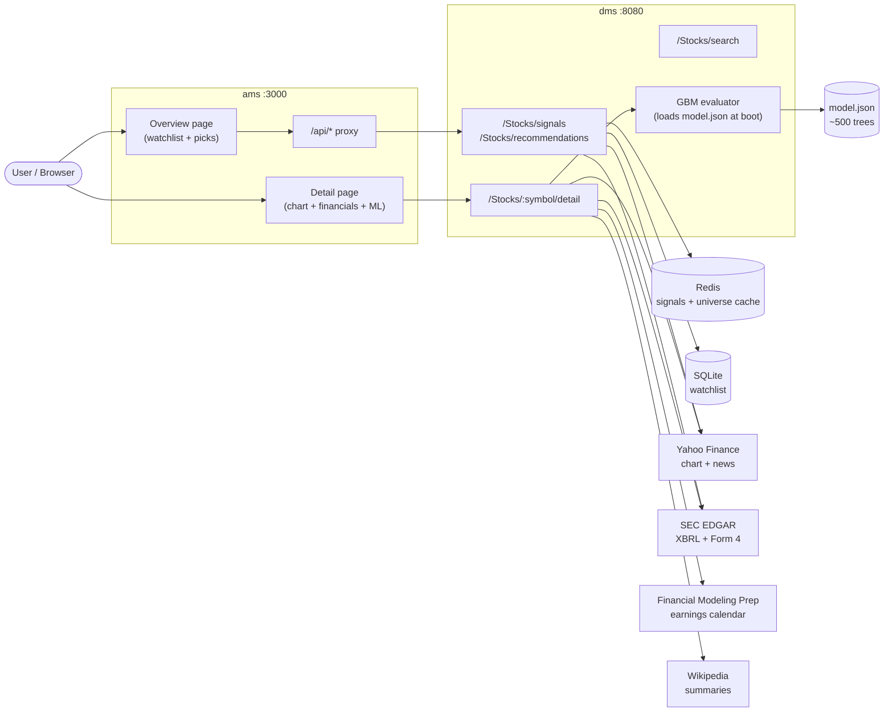
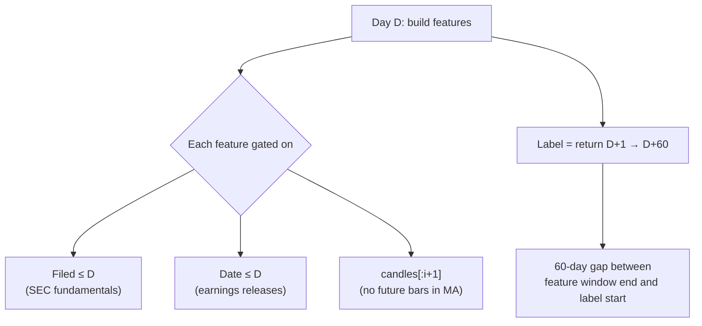
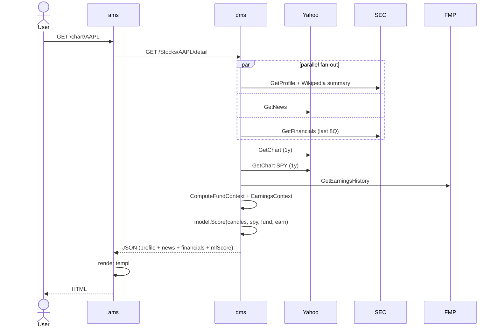

# Stock Advisor

Self-hosted stock screener combining technical indicators, point-in-time fundamentals, and a gradient-boosted ML signal. Built to learn quant feature engineering on free APIs.

> **Public showcase repo** — architecture and design only. Source lives in a private repo.

## Stack

| Layer | Tech |
|-------|------|
| **ams** (port 3000) | Go · Fiber · templ (server-rendered HTML, no JS framework) · TailwindCSS |
| **dms** (port 8080) | Go · Fiber · sync.WaitGroup fan-out |
| **storage** | Redis (signal cache, 5–30min TTL) · SQLite (watchlist) |
| **ML** | Python `scikit-learn` GradientBoostingClassifier → serialized to JSON → evaluated in Go |
| **data** | Yahoo Finance (OHLCV) · SEC EDGAR (XBRL fundamentals, Form 4 insiders) · Financial Modeling Prep (earnings calendar) · Wikipedia (company summaries) |

## Architecture

## ML signal

A binary classifier trained on `(symbol, date)` rows to predict whether the symbol beats SPY by ≥5% over the next 60 trading days.

| Layer | Detail |
|-------|--------|
| **Universe** | ~96 large-cap US tickers · 5 years history · ~96k labelled rows |
| **Label** | `1` if `forward_60d_return > spy_forward_60d_return + 0.05`, else `0`. ~29% positive rate. |
| **CV** | `TimeSeriesSplit(n_splits=5)` — train on past folds, test on future. No random shuffling. |
| **Features (24)** | Technical (MA20/50/200 gap, RSI14, week52 position, divergence, M/W pattern) · SPY regime · YoY revenue/net income/operating income · margins (op, net) · valuation (log P/S, earnings yield) · earnings surprise + days since + beat streak |
| **Model** | sklearn `GradientBoostingClassifier(n_estimators=500, max_depth=3, lr=0.02)` |
| **Serialization** | Trees flattened to parallel `feature`/`threshold`/`left`/`right`/`value` arrays in JSON. Go reads them, evaluates `sigmoid(init + Σ lr · tree(x))` at request time. |
| **Honest AUC** | ~0.55–0.58 on time-split CV. Below 0.55 = badge hidden by floor in `usecase.go`. |

### Why so low?
0.55 is the realistic ceiling for **public daily-bar data on large-caps**:

- Market is efficient — anything obvious in price + filings is already arbitraged.
- 60-day labels are mostly macro noise.
- ~96k rows caps feature count before overfit.
- No alternative data (sentiment, intraday, alt-data) → no 0.65+ paths.

The badge is honestly framed as a **tiebreaker, not an oracle**.

## Point-in-time correctness

The biggest trap in stock prediction is **leakage** — letting the model peek at the future. Three guards:

- Quarterly fundamentals (revenue, margins, P/S) only contribute if `Filed ≤ asOf` — SEC filings hit ~30–90 days after period-end, this matters.
- Earnings surprises only contribute if announcement `Date ≤ asOf`.
- All moving averages, RSI, etc. are computed from `candles[:i+1]` — never the full series.

## Key design choices

| Decision | Why |
|----------|-----|
| **Two services, not one** | DMS is the boring data layer (no rendering); AMS is the boring view layer (no third-party API calls). Lets each evolve independently. |
| **Server-rendered HTML (templ)** | No SPA, no hydration, no client-state bugs. Page reloads are fine when each page is ~10kB and the data is already cached server-side. |
| **Go evaluates the model, Python trains it** | Training is a one-shot CLI run by a human (`cmd/training`). Serving is hot path — keeping it in Go avoids a Python sidecar, sklearn install, or RPC hop. JSON serialization is trivial for tree-based models. |
| **AUC floor in usecase.go (0.55)** | If `cv_auc_mean < 0.55`, the ML badge is hidden entirely. A model worse than random has no business being a user-facing signal. |
| **Redis cache TTLs differ** | Watchlist signals = 5min (user might add a ticker). Universe recommendations = 30min (rarely changes). Both invalidated on watchlist mutations. |
| **SIC category index lazy-warmed** | First request triggers a parallel SEC profile fetch for the whole Universe (~30s, sync.Once). Subsequent requests instant. Filter dropdown then driven from in-memory map. |

## Sequence: detail page request

## Why I built this

Quant finance is gatekept by paid data feeds (Bloomberg, Refinitiv) and proprietary signals. I wanted to know: **with only free APIs, how far can a single developer push out-of-sample predictive power?** The honest answer (~0.55–0.58 AUC) is the interesting part — it forces clean point-in-time engineering and honest framing of uncertainty.

Secondary goals:
- Practice Go in a real concurrent setup (parallel fan-out, sync primitives, channel-based rate limiting).
- Learn templ as a server-rendered alternative to React for personal projects.
- Experiment with GBM serialization patterns for hot-path inference in non-Python services.

## Author

[Nick Chung](https://github.com/NickChunglolz)
