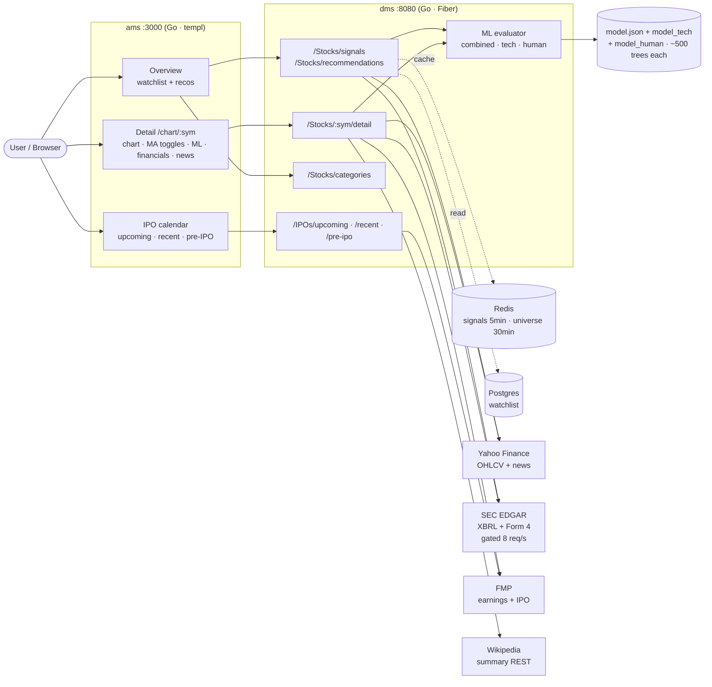
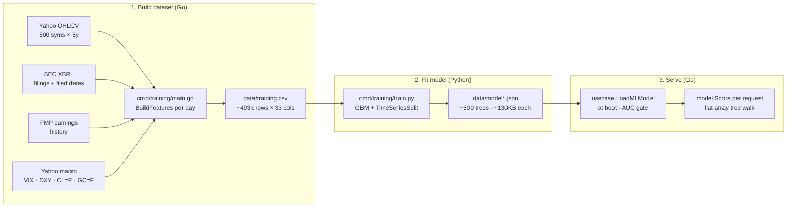
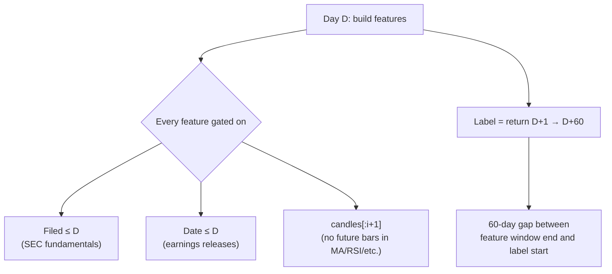
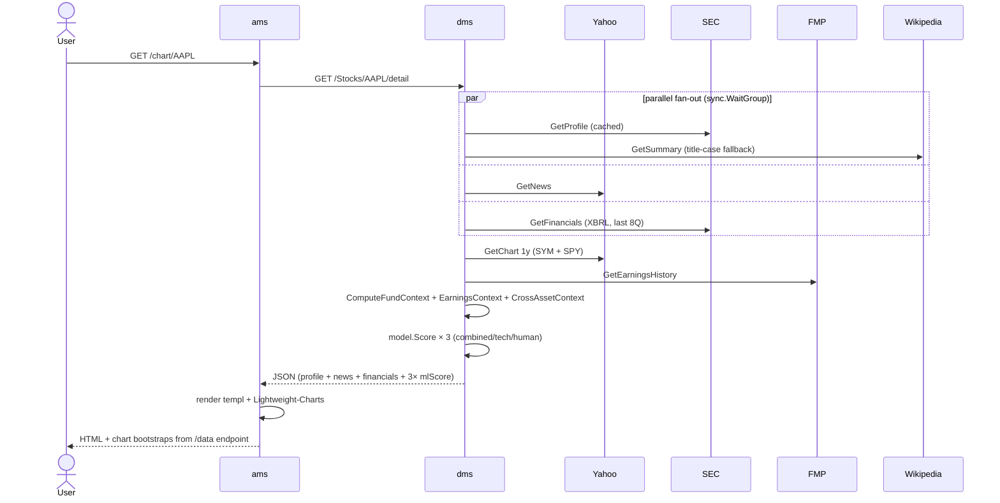

# Stock Advisor

Self-hosted stock screener combining technical indicators, point-in-time fundamentals, cross-asset macro signals, and gradient-boosted ML scoring. Built to learn quant feature engineering on free APIs.

> **Public showcase repo** — architecture and design only. Source lives in a private repo.

## Stack

| Layer | Tech |
|-------|------|
| **ams** (port 3000) | Go · Fiber · templ (server-rendered HTML, no JS framework) · TailwindCSS · Lightweight-Charts v4 |
| **dms** (port 8080) | Go · Fiber · sync.WaitGroup fan-out · 125ms-gated SEC client with 24h TTL cache |
| **storage** | Redis (signal/universe cache, 5–30min TTL) · Postgres (watchlist) · in-memory caches |
| **ML training** | Python · scikit-learn `GradientBoostingClassifier` · LightGBM (alt path) · `TimeSeriesSplit` CV |
| **ML serving** | Trees serialized to JSON · evaluated in Go on the hot path · no Python sidecar |
| **data sources** | Yahoo Finance (OHLCV + news) · SEC EDGAR (XBRL fundamentals, Form 4 insiders) · Financial Modeling Prep (earnings + IPO calendar) · Wikipedia (company summaries) |

## System architecture



## Service boundary

| Service | Responsibility | Never does |
|---------|---------------|-----------|
| **dms** | Talks to upstreams. Computes features. Runs ML. Returns JSON. | Renders HTML. Knows about templ. Knows browsers exist. |
| **ams** | Renders HTML. Owns UI state. Proxies API calls. | Talks to Yahoo/SEC/FMP directly. Knows the ML model exists. |

The split exists so each service evolves independently — DMS can swap data sources without touching the UI; AMS can rebuild the design without affecting upstream integrations.

## ML signal

A binary classifier trained on `(symbol, date)` rows that predicts whether a symbol will beat SPY by ≥5% over the next 60 trading days.

| Layer | Detail |
|-------|--------|
| **Universe** | S&P 500-ish (~500 tickers) · 5 years of daily bars · ~493k labelled rows after warmup + label-window trimming |
| **Label** | `1` if `forward_60d_return > spy_forward_60d_return + 0.05`, else `0`. ~29% positive rate. |
| **Cross-validation** | `TimeSeriesSplit(n_splits=5)` — train on past folds, test on future. No random shuffling, no leakage across the time boundary. |
| **Features** | 30 columns — technical · SPY regime · fundamentals · valuation · earnings · cross-asset macro (see below) |
| **Model** | `GradientBoostingClassifier(n_estimators=500, max_depth=3, learning_rate=0.02)` — sklearn default-shape tree boosting. LightGBM alt path under `train_lgb.py`. |
| **Serialization** | Trees flattened to parallel `feature`/`threshold`/`left`/`right`/`value` arrays in JSON. Go reads them at boot and evaluates `sigmoid(init + Σ lr · tree(x))` per request. No Python at serve time. |

### The three sub-models

Instead of one black-box, the same training pipeline produces three scorers from disjoint feature subsets so the UI can show **why** the signal leans the way it does:

| Model | Features | CV AUC | Question it answers |
|-------|----------|--------|---------------------|
| **Combined** | all 30 | **0.580** | Holistic — best single number |
| **Technical** | price · MA · RSI · fundamentals · valuation | **0.570** | "Is the chart + book saying buy?" |
| **Human nature** | VIX · DXY · oil · gold · earnings reaction · cross-asset | **0.548** | "Is the macro/sentiment backdrop friendly?" |

Combined is the user-facing badge; the sub-models render as context badges so a user can spot "tech says buy, but the macro side is inconclusive". A model with `cv_auc < AUC_FLOOR` (0.55 for combined, 0.50 for sub-models) is hidden — a useless model has no business driving UI.

### Feature catalogue (30)

```
Technical (8):   ma20_gap, ma50_gap, ma200_gap, rsi14, week52_pos,
                 divergence, pattern, ma20_rising
SPY regime (3):  spy_ma20_gap, spy_rsi, spy_week52_pos
Fundamentals (6): rev_yoy, netinc_yoy, opinc_yoy, op_margin, net_margin, fund_available
Valuation (3):   log_ps, earn_yield, val_available
Earnings (4):    earn_surprise, days_since_earn, beat_streak, earn_available
Cross-asset (6): vix_level, vix_chg_20d, dxy_chg_20d, oil_chg_20d, gold_chg_20d, cross_available
```

`*_available` flags exist because Tree-based models handle missingness via a 0/1 sentinel cleanly — rather than impute, the tree learns "when fund_available=0, ignore the fundamental columns".

### Why ~0.58 ceiling?

0.55–0.58 is the realistic ceiling for **public daily-bar data on large-caps**:

- The market is efficient — anything obvious in price + filings is already arbitraged.
- 60-day labels are mostly macro noise (VIX, rates) plus idiosyncratic news.
- ~493k rows still caps usable feature count before overfit.
- No alternative data → no 0.65+ paths. (Adding VADER news sentiment is on the roadmap.)

The combined badge is **honestly framed as a tiebreaker, not an oracle**. The AUC floor + sub-model breakdown keep the UX from overclaiming.

## Training pipeline



### Step 1 — Build the dataset

`go run ./cmd/training` does the heavy lifting:

1. **Fetches 5y daily OHLCV** for every Universe ticker + SPY + macro series (VIX/DXY/oil/gold) from Yahoo.
2. **Walks the candles forward** one day at a time, starting after the warmup window (`warmupBars=200` bars to compute MA200) and stopping `forwardDays=60` before the end (so every row has a valid label).
3. **For each day D**, builds the feature vector via `usecase.BuildFeatures` — the same function the live API uses, so training and inference can never drift.
4. **Computes the label**: `1` if `forward_60d_return - spy_forward_60d_return > 0.05`, else `0`.
5. **Writes `(symbol, date, ...features..., fwd_ret_20d, spy_fwd_ret_20d, label)`** to `data/training.csv`.

Output: ~493k rows × 33 columns, ~147 MB. Excluded from git via `.gitignore` — regenerable in ~10 minutes.

### Step 2 — Fit the model

`python cmd/training/train.py --out data/model.json` (variants for tech/human via `--drop` flag):

1. **Loads the CSV** with pandas.
2. **Drops requested columns** (used to produce sub-models: e.g. `model_tech.json` drops the macro + earnings columns; `model_human.json` drops most chart features).
3. **TimeSeriesSplit(n_splits=5)** — folds are time-ordered, never shuffled. Fold 1 trains on the earliest data and tests on the next chunk; Fold 5 trains on most of history and tests on the most recent slice.
4. **For each fold**, fits `GradientBoostingClassifier(n_estimators=500, max_depth=3, learning_rate=0.02)` and scores AUC on the held-out future.
5. **Refits on the full dataset** for the final model artifact.
6. **Serializes** trees to JSON: each tree is `{feature: [...], threshold: [...], left: [...], right: [...], value: [...]}` parallel arrays. The whole model is `{init_score, learning_rate, trees: [...], features: [...], cv_auc_mean, cv_auc_folds, n_rows, pos_rate}`.

This format is intentionally trivial for a Go reader to walk — no XGBoost binary, no pickle, no Python required at serve time.

### Step 3 — Serve in Go

`usecase.LoadMLModel(path)` at process boot:

1. Reads the JSON.
2. Builds `featureIdx []int` — maps each model feature name to its position in the live `FeatureNames` vector. This is what lets a sub-model trained on 13 columns pluck its inputs out of the full 30-column vector built by `BuildFeatures`.
3. Returns `nil` (gracefully) if AUC < floor or file missing — the UI then hides the corresponding badge.

`model.Score(candles, spy, fund, earn, cross)` per request: builds the feature vector via the **same** `BuildFeatures` used in training, slices it through `featureIdx`, walks each tree (a tight loop over the parallel arrays), sums `Σ lr · tree(x) + init_score`, returns `sigmoid(sum)` as the probability.

A typical request evaluates 500 trees × ~16 comparisons each in well under a millisecond — model evaluation is never the bottleneck.

## Point-in-time correctness

The biggest trap in stock prediction is **leakage** — letting the model peek at the future. Three guards enforced in `BuildFeatures`:



- **Quarterly fundamentals** (revenue, margins, P/S) only contribute if `Filed ≤ asOf`. SEC filings hit 30–90 days after the period ends — using the period-end date instead of the filing date is a common silent leakage source.
- **Earnings surprises** only contribute if announcement `Date ≤ asOf`.
- **All moving averages, RSI, pattern detection** compute from `candles[:i+1]` — never the full series.
- **`TimeSeriesSplit`** in CV: training fold is always strictly older than test fold. No random k-fold shuffle.

## Sequence: detail page request



## Key design choices

| Decision | Why |
|----------|-----|
| **Two services, not one** | DMS is the data layer; AMS is the view layer. Either can be replaced without touching the other. |
| **Server-rendered HTML (templ)** | No SPA, no hydration, no client-state bugs. Pages are ~10kB; data is already cached server-side. |
| **Go evaluates the model, Python trains it** | Training is a human-run CLI. Serving is hot-path — keeping it in Go avoids a sklearn install, Python sidecar, or RPC hop. JSON serialization is trivial for tree-based models. |
| **3 sub-models, not 1** | `cv_auc=0.58` doesn't say *why*. Splitting into "technical" and "human nature" lets the UI explain a disagreement instead of hiding it. |
| **AUC floor enforced in usecase.go** | If `cv_auc_mean < floor`, the badge is hidden. A model worse than random has no business driving the UI. |
| **SEC EDGAR 125ms-gated + 24h cache** | EDGAR's published rate ceiling is 10 req/s. We sit at ~8 req/s with a global mutex and cache immutable Form 4 XMLs for 24h. Cut cold-start of /recommendations from 5min to 14s. |
| **Tree missingness via `*_available` flags** | Cleaner than imputation. The tree learns "when `fund_available=0`, ignore the fundamental branches". |
| **Wikipedia title-case fallback** | SEC names are ALL CAPS ("SPACE EXPLORATION TECHNOLOGIES CORP") — Wikipedia REST matches "Space Exploration Technologies" via redirect. The client tries both. |
| **Redis cache TTLs differ** | Watchlist signals = 5min (user might add a ticker). Universe recos = 30min (rarely changes). Both invalidated on watchlist mutations. |
| **SIC category index lazy-warmed** | First request triggers a parallel SEC profile fetch for the whole Universe (~30s under the 125ms gate, `sync.Once`). Subsequent requests instant. Dropdown driven from the in-memory map. |
| **Per-stock MA20/50/200 toggles** | Computed client-side from the close series; toggling flips `visible` on the line series instead of rebuilding. Avoids server round-trip and keeps the API surface narrow. |

## Why I built this

Quant finance is gatekept by paid data feeds (Bloomberg, Refinitiv) and proprietary signals. I wanted to know: **with only free APIs, how far can a single developer push out-of-sample predictive power?** The honest answer (~0.55–0.58 AUC) is the interesting part — it forces clean point-in-time engineering and honest framing of uncertainty.

Secondary goals:
- Practice Go in a real concurrent setup (parallel fan-out, mutex-gated rate limiting, sync.Once warming).
- Learn templ as a server-rendered alternative to React for personal projects.
- Experiment with GBM serialization patterns for hot-path inference in non-Python services.
- Push tree-based ML beyond a single black-box: decomposed sub-models that *explain* the prediction.

## Roadmap

- Form 4 PIT insider buying refactor (currently 30d window, no PIT filing-date awareness)
- Sector-relative feature engineering (vs sector ETF, not just SPY)
- VADER news sentiment via Yahoo news titles
- Ensemble: GBM + LightGBM + XGBoost stacked
- IPO calendar UI (DMS layer ready; AMS page pending)
- Per-stock IPO badge on /chart/SYMBOL for recently-listed tickers

## Author

[Nick Chung](https://github.com/NickChunglolz)
