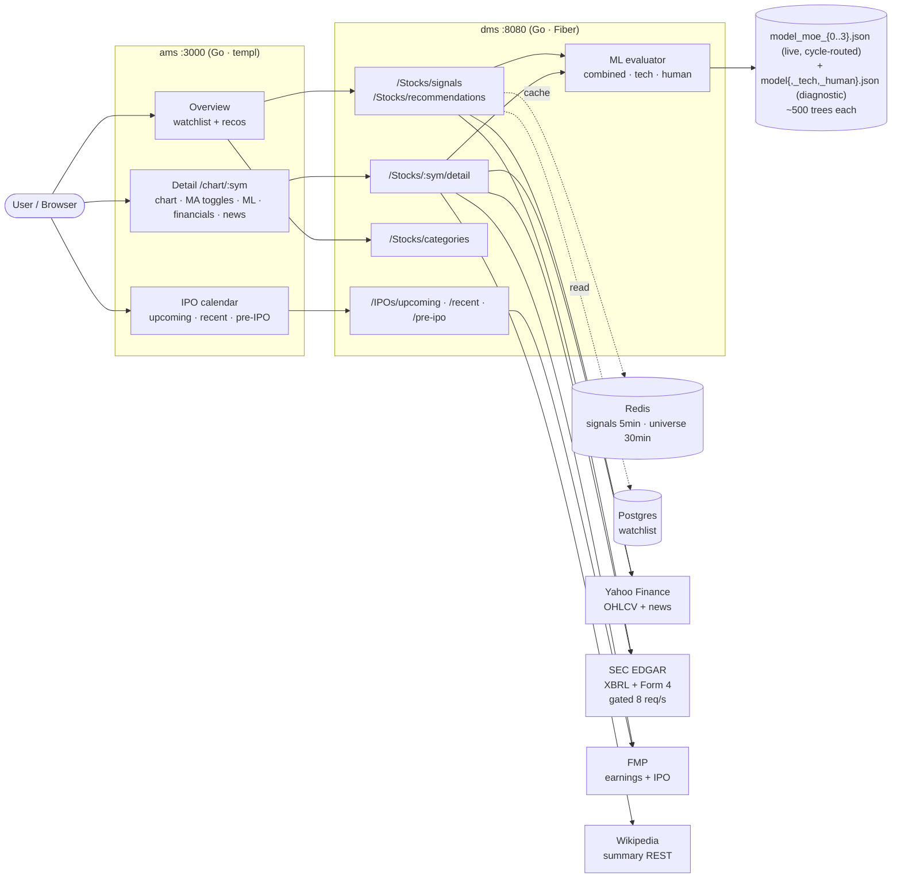
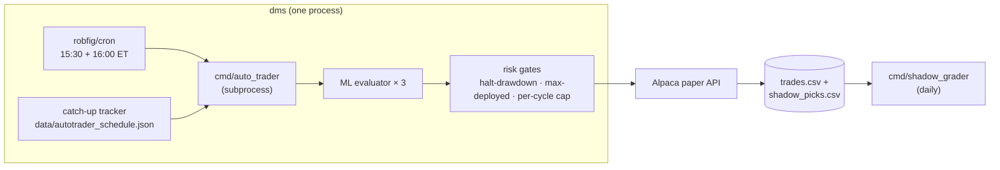
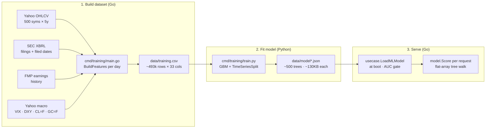
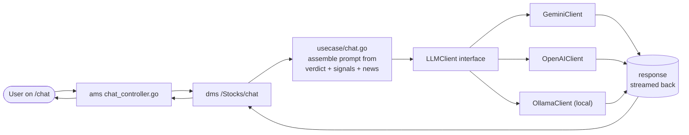
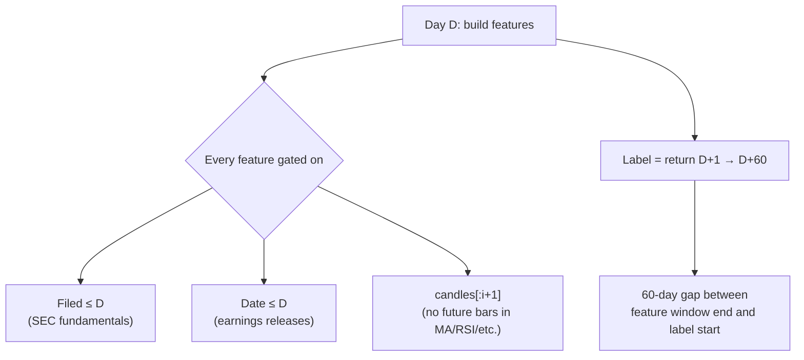
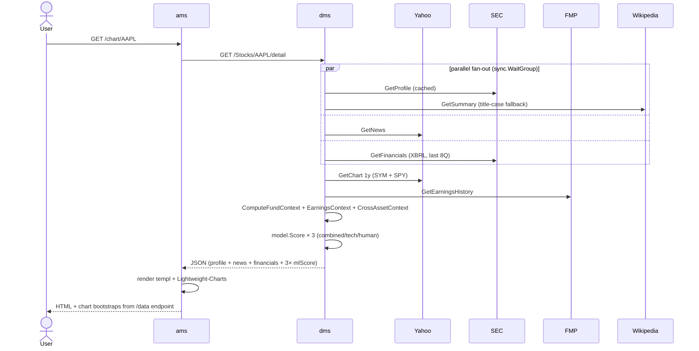

# Stock Advisor

Self-hosted stock screener combining technical indicators, point-in-time fundamentals, cross-asset macro signals, and gradient-boosted ML scoring. Built to learn quant feature engineering on free APIs.

> **Public showcase repo** — architecture and design only. Source lives in a private repo.

## Stack

| Layer | Tech |
|-------|------|
| **ams** (port 3000) | Go · Fiber · templ (server-rendered HTML, no JS framework) · TailwindCSS · Lightweight-Charts v4 |
| **dms** (port 8080) | Go · Fiber · sync.WaitGroup fan-out · 125ms-gated SEC client with 24h TTL cache |
| **storage** | Redis (signal/universe cache, 5–30min TTL) · Postgres (watchlist) · in-memory caches |
| **ML training** | Python · LightGBM · `TimeSeriesSplit` CV · 11-window rolling-Sharpe eval as primary metric · sklearn `GradientBoostingClassifier` legacy path retained |
| **ML serving** | Trees serialized to JSON · evaluated in Go on the hot path · no Python sidecar · cycle-phase router selects per-regime expert (MoE) at request time |
| **data sources** | Yahoo Finance (OHLCV + news) · SEC EDGAR (XBRL fundamentals, Form 4 insiders) · Financial Modeling Prep (earnings + IPO calendar) · Wikipedia (company summaries) |

## System architecture


```mermaid
flowchart LR
    User([User / Browser])

    subgraph AMS["ams :3000 (Go · templ)"]
        Overview["Overview<br/>watchlist + recos"]
        Detail["Detail /chart/:sym<br/>chart · MA toggles · ML · financials · news"]
        IPO["IPO calendar<br/>upcoming · recent · pre-IPO"]
    end

    subgraph DMS["dms :8080 (Go · Fiber)"]
        Signals["/Stocks/signals<br/>/Stocks/recommendations"]
        DetailAPI["/Stocks/:sym/detail"]
        Categories["/Stocks/categories"]
        IPOAPI["/IPOs/upcoming · /recent · /pre-ipo"]
        MLEval["ML evaluator<br/>combined · tech · human"]
    end

    Redis[("Redis<br/>signals 5min · universe 30min")]
    PG[("Postgres<br/>watchlist")]
    Models[("model_moe_{0..3}.json (live, cycle-routed)<br/>+ model{,_tech,_human}.json (diagnostic)<br/>~500 trees each")]

    Yahoo[Yahoo Finance<br/>OHLCV + news]
    SEC[SEC EDGAR<br/>XBRL + Form 4<br/>gated 8 req/s]
    FMP[FMP<br/>earnings + IPO]
    Wiki[Wikipedia<br/>summary REST]

    User --> Overview & Detail & IPO
    Overview --> Signals & Categories
    Detail --> DetailAPI
    IPO --> IPOAPI
    Signals --> Yahoo & SEC & MLEval
    DetailAPI --> Yahoo & SEC & FMP & Wiki & MLEval
    IPOAPI --> FMP
    Signals -.cache.-> Redis
    Signals -.read.-> PG
    MLEval --> Models
```

## Service boundary

| Service | Responsibility | Never does |
|---------|---------------|-----------|
| **dms** | Talks to upstreams. Computes features. Runs ML. Returns JSON. | Renders HTML. Knows about templ. Knows browsers exist. |
| **ams** | Renders HTML. Owns UI state. Proxies API calls. | Talks to Yahoo/SEC/FMP directly. Knows the ML model exists. |

The split exists so each service evolves independently — DMS can swap data sources without touching the UI; AMS can rebuild the design without affecting upstream integrations.

## ML signal

A binary classifier trained on `(symbol, date)` rows that predicts whether a symbol will beat SPY by ≥5% over the next 60 trading days.

| Layer | Detail |
|-------|--------|
| **Universe** | S&P 500-ish (~500 tickers) · 5 years of daily bars · ~493k labelled rows after warmup + label-window trimming |
| **Label** | `1` if `forward_60d_return > spy_forward_60d_return + 0.05`, else `0`. ~29% positive rate. |
| **Cross-validation** | `TimeSeriesSplit(n_splits=5)` — train on past folds, test on future. No random shuffling, no leakage across the time boundary. |
| **Features** | 30 columns — technical · SPY regime · fundamentals · valuation · earnings · cross-asset macro (see below) |
| **Model** | LightGBM (`train_lgb.py` + `train_all.sh`) — multiple variants from the same CSV via `--drop` lists. The live serving path is a **Mixture-of-Experts** (`train_moe.py`) that routes each request to one of 4 cycle-phase experts. Earlier sklearn `GradientBoostingClassifier` path retained for parity. Isotonic-calibrated post-fit so the probability rank matches realized rates. |
| **Serialization** | Trees flattened to parallel `feature`/`threshold`/`left`/`right`/`value` arrays in JSON. Go reads them at boot and evaluates `sigmoid(init + Σ lr · tree(x))` per request. No Python at serve time. |

### Live model: cycle-routed Mixture-of-Experts

The user-facing badge is driven by a per-regime MoE — one LightGBM expert per market cycle phase, gated at request time by a cycle-phase detector derived from VIX, SPY trend, and breadth state.

| Cycle phase | Expert | When it serves |
|---|---|---|
| Early bull | `model_moe_0.json` | VIX low, SPY above MA200 rising, breadth expanding |
| Late bull | `model_moe_1.json` | VIX low-rising, breadth narrowing |
| Early bear | `model_moe_2.json` | VIX spiking, SPY breaking MA200 |
| Late bear | `model_moe_3.json` | VIX elevated, capitulation breadth |

| | Mean Sharpe (11 rolling 3y windows) | Best window | Wins (of 11) | Live CV AUC |
|---|---|---|---|---|
| **MoE per-cycle** (live) | **+0.57** | +1.11 | **5** | **0.565** |
| Phase 2c single combined (prior live) | +0.52 | +0.86 | 0 | 0.547 |

The router falls back to the combined model if the cycle detector returns "uncertain" or if a routed expert fails its AUC floor. A single env var (`STOCKADVISOR_MOE=false`) reverts to the previous single-model path — kept for the first 2 weeks of live operation as an emergency rollback.

### Diagnostic variants (context, not live verdict)

The same training pipeline produces three additional scorers from disjoint feature subsets. These don't drive the badge — they render as context chips so a user can spot a disagreement:

| Variant | Features | CV AUC | Question it answers |
|-------|----------|--------|---------------------|
| **Combined** | all features | **0.565** | Holistic single-model baseline |
| **Technical** | price · MA · RSI · fundamentals · valuation | **0.55x** | "Is the chart + book saying buy?" |
| **Human nature** | VIX · DXY · oil · gold · earnings reaction · cross-asset · news sentiment | **0.52x** | "Is the macro/sentiment backdrop friendly?" |

A variant with `cv_auc < AUC_FLOOR` (0.55 for combined, 0.50 for sub-models) is hidden — a useless model has no business driving UI. The human-nature variant is intentionally kept on the page even when it's near coin-flip, because **dissent badges have UX value beyond predictive value**.

### Evaluation methodology: rolling-window, not single split

Single-window CV AUC was producing whipsaw verdicts (a variant looked NEGATIVE on one slice, POSITIVE on the next). The primary metric is now **median Sharpe across 11 overlapping 3-year windows** spanning 2014→2025. A model is only promoted if its median beats the incumbent AND it wins ≥2 of the 11 windows. This is what flipped MoE from "marginal AUC bump" to "clear winner" — and what kept several research variants (rank-loss, cycle-only, recovery-overlay) on the bench despite single-window peaks.

### Feature catalogue (30)

```
Technical (8):   ma20_gap, ma50_gap, ma200_gap, rsi14, week52_pos,
                 divergence, pattern, ma20_rising
SPY regime (3):  spy_ma20_gap, spy_rsi, spy_week52_pos
Fundamentals (6): rev_yoy, netinc_yoy, opinc_yoy, op_margin, net_margin, fund_available
Valuation (3):   log_ps, earn_yield, val_available
Earnings (4):    earn_surprise, days_since_earn, beat_streak, earn_available
Cross-asset (6): vix_level, vix_chg_20d, dxy_chg_20d, oil_chg_20d, gold_chg_20d, cross_available
```

`*_available` flags exist because Tree-based models handle missingness via a 0/1 sentinel cleanly — rather than impute, the tree learns "when fund_available=0, ignore the fundamental columns".

### AUC ceiling — what's achievable and what isn't

Current live: **0.565**. Committed north-star: **≥0.60**. Stretch: **0.65**.

| Path | Cost | Realistic ceiling | Status |
|---|---|---|---|
| Stack free enrichments (GDELT GKG, EDGAR transcripts, web-traffic proxies, narrow satellite) | $0 + dev time | 0.57-0.58 | Active |
| Add cheapest paid alt-data (Polygon options + RavenPack-class news) | $25-50k/yr | 0.60-0.62 | Gated on subscription product |
| Full pivot: intraday minute bars + tick DB + transformer on price+text | $100k+/yr + quarter rebuild | 0.62-0.65 | Only if above plateau |

**What caps you at ~0.58 on public daily-bar large-cap data:**

- The market is efficient — anything obvious in price + filings is already arbitraged.
- 20–60 day labels are mostly macro noise (VIX, rates) plus idiosyncratic news.
- LightGBM on tabular features approaches its own ceiling around 0.58-0.60 regardless of data.
- Credit-card spend, full OPRA options microstructure, and RavenPack-grade entity tagging are firmly gated behind paid B2B feeds — no DIY substitute.

The combined badge is **honestly framed as a tiebreaker, not an oracle**. The AUC floor + diagnostic-variant breakdown keep the UX from overclaiming.

## Auto-trader (paper money)

Once the signal was good enough to backtest with a positive Sharpe, the next question was: **does this hold up against real fills and slippage?** A paper-money auto-trader closes the loop end-to-end.

| Layer | Detail |
|-------|--------|
| **Broker** | Alpaca paper API — bracket orders (entry + take-profit + stop) submitted at NY close, mirrors real US market 9:30–16:00 ET. |
| **Two gates, one binary** | `strict` (rank gate: top-K by `ml × rr`, mlFloor 0.10, rr ≥ 2.0, blockDC on) writes to the main P&L journal. `shadow` (mlFloor 0.05, blockDC off) writes to a `-shadow` CID-suffixed journal so realized returns can be compared without contaminating the strict strategy. The strict gate moved from a hard `ml ≥ 0.28` floor to top-K-by-`ml×rr` after the OOF-vs-live calibration drift made the fixed threshold fire essentially zero trades. |
| **Risk gates** | Per-trade sizing capped at `AUTO_TRADE_PCT_EQUITY` (default 1% equity). Total deployed capped at `AUTO_TRADE_MAX_DEPLOYED` (default 30%). Trading halts when realized drawdown hits `AUTO_TRADE_HALT_DRAWDOWN` (default 10%) — file-tracked starting equity prevents reset-on-restart. |
| **Per-cycle cap** | Max 15 orders per fire — keeps any one bad day from blowing the budget. |
| **Idempotent re-fire** | Dedups against existing open positions before submitting — a double-fired cycle (catch-up or reboot) is a no-op for symbols already held. |
| **In-DMS scheduler** | `robfig/cron` loop inside the DMS process. Strict at 15:30 ET, shadow at 16:00 ET, Mon-Fri. File-based last-run tracker (`data/autotrader_schedule.json`) catches up missed fires after reboots within the same trading day, with a first-boot grace seeded to today to avoid replay storms after a fresh deploy. |
| **Shadow grader** | `cmd/shadow_grader` walks yesterday's `shadow_picks.csv` and grades against realized next-day returns. Outputs hit-rate / P&L drift per gate, feeding the next tuning round. |
| **Single source of truth** | One DMS process owns scheduling, ML scoring, broker calls, and logging. Replaces two separate `launchd` plists — adding a new fire window now means editing a Go slice, not XML. |


```mermaid
flowchart LR
    subgraph DMS["dms (one process)"]
        Cron["robfig/cron<br/>15:30 + 16:00 ET"]
        Catchup["catch-up tracker<br/>data/autotrader_schedule.json"]
        Trader["cmd/auto_trader<br/>(subprocess)"]
        ML["ML evaluator × 3"]
        Risk["risk gates<br/>halt-drawdown · max-deployed · per-cycle cap"]
    end
    Alpaca[Alpaca paper API]
    Journal[("trades.csv +<br/>shadow_picks.csv")]
    Grader["cmd/shadow_grader<br/>(daily)"]

    Cron --> Trader
    Catchup --> Trader
    Trader --> ML --> Risk --> Alpaca
    Alpaca --> Journal
    Journal --> Grader
```

### News pipelines

Two complementary news signals run on different cadences and resolutions:

**Per-symbol (real-time, last 24h)** — for the human-nature variant and the chat endpoint:

1. **04:00 ET — collect** (`cmd/news_collector`) — pulls last 24h of headlines per symbol from FMP, writes `news_raw.csv`.
2. **04:05 ET — score** (`cmd/training/score_news.py`) — FinBERT (`ProsusAI/finbert`) classifies each headline, aggregates per-symbol mean + recency-weighted sentiment, writes `news_sentiment.csv`.
3. **04:10 ET — reload** — atomic in-memory swap of the news store. No DMS restart. Failures keep yesterday's sentiment rather than nulling.

FinBERT (not VADER) was chosen because it's domain-trained on financial text — "beat estimates by a penny" reads as positive to FinBERT but neutral to VADER's general-purpose lexicon.

**Market-wide (historical archive, training-only)** — via GDELT v2 doc API:

- Daily mean tone + raw doc count on the `"stock market"` query, 2017+ archive depth.
- Joined to every training row as 4 new features (`news_sent_7d`, `news_sent_30d`, `news_count_7d`, `news_available`).
- Standalone +0.010 AUC lift on the combined variant — modest but the cheapest credible news signal that has more than 7 days of history.
- Coarse (one daily tone for the whole market, not per-symbol). A per-symbol GDELT puller exists as research-WIP, blocked on GDELT's sticky free-tier throttle (overnight batch only).

## Training pipeline


```mermaid
flowchart LR
    subgraph Step1["1. Build dataset (Go)"]
        Yahoo1[Yahoo OHLCV<br/>500 syms × 5y]
        SEC1[SEC XBRL<br/>filings + filed dates]
        FMP1[FMP earnings<br/>history]
        Macro[Yahoo macro<br/>VIX · DXY · CL=F · GC=F]
        Build[cmd/training/main.go<br/>BuildFeatures per day]
        CSV["data/training.csv<br/>~493k rows × 33 cols"]
    end
    subgraph Step2["2. Fit model (Python)"]
        Train[cmd/training/train.py<br/>GBM + TimeSeriesSplit]
        JSON["data/model*.json<br/>~500 trees · ~130KB each"]
    end
    subgraph Step3["3. Serve (Go)"]
        Load[usecase.LoadMLModel<br/>at boot · AUC gate]
        Score[model.Score per request<br/>flat-array tree walk]
    end

    Yahoo1 & SEC1 & FMP1 & Macro --> Build --> CSV
    CSV --> Train --> JSON
    JSON --> Load --> Score
```

### Step 1 — Build the dataset

`go run ./cmd/training` does the heavy lifting:

1. **Fetches 5y daily OHLCV** for every Universe ticker + SPY + macro series (VIX/DXY/oil/gold) from Yahoo.
2. **Walks the candles forward** one day at a time, starting after the warmup window (`warmupBars=200` bars to compute MA200) and stopping `forwardDays=60` before the end (so every row has a valid label).
3. **For each day D**, builds the feature vector via `usecase.BuildFeatures` — the same function the live API uses, so training and inference can never drift.
4. **Computes the label**: `1` if `forward_60d_return - spy_forward_60d_return > 0.05`, else `0`.
5. **Writes `(symbol, date, ...features..., fwd_ret_20d, spy_fwd_ret_20d, label)`** to `data/training.csv`.

Output: ~493k rows × 33 columns, ~147 MB. Excluded from git via `.gitignore` — regenerable in ~10 minutes.

### Step 2 — Fit the model

`python cmd/training/train.py --out data/model.json` (variants for tech/human via `--drop` flag):

1. **Loads the CSV** with pandas.
2. **Drops requested columns** (used to produce sub-models: e.g. `model_tech.json` drops the macro + earnings columns; `model_human.json` drops most chart features).
3. **TimeSeriesSplit(n_splits=5)** — folds are time-ordered, never shuffled. Fold 1 trains on the earliest data and tests on the next chunk; Fold 5 trains on most of history and tests on the most recent slice.
4. **For each fold**, fits `GradientBoostingClassifier(n_estimators=500, max_depth=3, learning_rate=0.02)` and scores AUC on the held-out future.
5. **Refits on the full dataset** for the final model artifact.
6. **Serializes** trees to JSON: each tree is `{feature: [...], threshold: [...], left: [...], right: [...], value: [...]}` parallel arrays. The whole model is `{init_score, learning_rate, trees: [...], features: [...], cv_auc_mean, cv_auc_folds, n_rows, pos_rate}`.

This format is intentionally trivial for a Go reader to walk — no XGBoost binary, no pickle, no Python required at serve time.

### Step 3 — Serve in Go

`usecase.LoadMLModel(path)` at process boot:

1. Reads the JSON.
2. Builds `featureIdx []int` — maps each model feature name to its position in the live `FeatureNames` vector. This is what lets a sub-model trained on 13 columns pluck its inputs out of the full 30-column vector built by `BuildFeatures`.
3. Returns `nil` (gracefully) if AUC < floor or file missing — the UI then hides the corresponding badge.

`model.Score(candles, spy, fund, earn, cross)` per request: builds the feature vector via the **same** `BuildFeatures` used in training, slices it through `featureIdx`, walks each tree (a tight loop over the parallel arrays), sums `Σ lr · tree(x) + init_score`, returns `sigmoid(sum)` as the probability.

A typical request evaluates 500 trees × ~16 comparisons each in well under a millisecond — model evaluation is never the bottleneck.

## Chat endpoint — natural-language commentary

A `/Stocks/chat` endpoint wraps the model output in plain English so a user reading "POSITIVE 0.31" on the overview gets a sentence about *why*: which sub-model is leaning which way, what pattern the price detector saw, what news headlines crossed in the last 24h.

| Layer | Detail |
|---|---|
| **Prompt assembly** | `usecase/chat.go` builds a prompt with: model verdict + cycle phase + per-horizon scores (short/mid/long) + active price pattern + last-24h news sentiment + top-3 headlines. The LLM never sees raw OHLCV — it's a narrator over already-computed signals. |
| **Backend interface** | `infrastructure/client/llm.go` is a 4-method interface. Three implementations ship: `gemini.go`, `openai.go`, `ollama.go` (local). Swap by env (`CHAT_LLM_PROVIDER`); no code change. |
| **Graceful disable** | If `CHAT_LLM_PROVIDER` or `CHAT_LLM_API_KEY` is unset, the chat usecase returns nil and the controller serves a 503 "chat not configured" — the rest of the app keeps working. |
| **Guardrails** | The prompt explicitly tells the LLM *not* to fabricate price targets, *not* to make trading recommendations beyond what the model verdict already encodes, and to surface model uncertainty when the variants disagree. |


```mermaid
flowchart LR
    User([User on /chat]) --> AMS
    AMS["ams chat_controller.go"] --> DMS["dms /Stocks/chat"]
    DMS --> CtxAssemble["usecase/chat.go<br/>assemble prompt from<br/>verdict + signals + news"]
    CtxAssemble --> LLMIface["LLMClient interface"]
    LLMIface --> Gemini["GeminiClient"] & OpenAI["OpenAIClient"] & Ollama["OllamaClient (local)"]
    Gemini & OpenAI & Ollama --> Resp[("response<br/>streamed back")]
    Resp --> DMS --> AMS --> User
```

The architecture deliberately keeps the LLM as a **narrator over deterministic outputs**, not a predictor — the model verdict is computed in Go from the LightGBM serialization, and the LLM only explains it. This stays honest under audit ("what made the chatbot say buy?" has a deterministic trail back to the tree weights) and means a free local Ollama is a perfectly fine backend for personal use.

## Point-in-time correctness

The biggest trap in stock prediction is **leakage** — letting the model peek at the future. Three guards enforced in `BuildFeatures`:


```mermaid
flowchart TB
    A["Day D: build features"] --> B{"Every feature gated on"}
    B --> C["Filed ≤ D<br/>(SEC fundamentals)"]
    B --> D["Date ≤ D<br/>(earnings releases)"]
    B --> E["candles[:i+1]<br/>(no future bars in MA/RSI/etc.)"]
    A --> F["Label = return D+1 → D+60"]
    F --> G["60-day gap between<br/>feature window end and label start"]
```

- **Quarterly fundamentals** (revenue, margins, P/S) only contribute if `Filed ≤ asOf`. SEC filings hit 30–90 days after the period ends — using the period-end date instead of the filing date is a common silent leakage source.
- **Earnings surprises** only contribute if announcement `Date ≤ asOf`.
- **All moving averages, RSI, pattern detection** compute from `candles[:i+1]` — never the full series.
- **`TimeSeriesSplit`** in CV: training fold is always strictly older than test fold. No random k-fold shuffle.

## Sequence: detail page request


```mermaid
sequenceDiagram
    actor U as User
    participant A as ams
    participant D as dms
    participant Y as Yahoo
    participant S as SEC
    participant F as FMP
    participant W as Wikipedia

    U->>A: GET /chart/AAPL
    A->>D: GET /Stocks/AAPL/detail
    par parallel fan-out (sync.WaitGroup)
        D->>S: GetProfile (cached)
        D->>W: GetSummary (title-case fallback)
    and
        D->>Y: GetNews
    and
        D->>S: GetFinancials (XBRL, last 8Q)
    end
    D->>Y: GetChart 1y (SYM + SPY)
    D->>F: GetEarningsHistory
    D->>D: ComputeFundContext + EarningsContext + CrossAssetContext
    D->>D: model.Score × 3 (combined/tech/human)
    D-->>A: JSON (profile + news + financials + 3× mlScore)
    A->>A: render templ + Lightweight-Charts
    A-->>U: HTML + chart bootstraps from /data endpoint
```

## Key design choices

| Decision | Why |
|----------|-----|
| **Two services, not one** | DMS is the data layer; AMS is the view layer. Either can be replaced without touching the other. |
| **Server-rendered HTML (templ)** | No SPA, no hydration, no client-state bugs. Pages are ~10kB; data is already cached server-side. |
| **Go evaluates the model, Python trains it** | Training is a human-run CLI. Serving is hot-path — keeping it in Go avoids a sklearn install, Python sidecar, or RPC hop. JSON serialization is trivial for tree-based models. |
| **3 sub-models, not 1** | `cv_auc=0.58` doesn't say *why*. Splitting into "technical" and "human nature" lets the UI explain a disagreement instead of hiding it. |
| **AUC floor enforced in usecase.go** | If `cv_auc_mean < floor`, the badge is hidden. A model worse than random has no business driving the UI. |
| **SEC EDGAR 125ms-gated + 24h cache** | EDGAR's published rate ceiling is 10 req/s. We sit at ~8 req/s with a global mutex and cache immutable Form 4 XMLs for 24h. Cut cold-start of /recommendations from 5min to 14s. |
| **Tree missingness via `*_available` flags** | Cleaner than imputation. The tree learns "when `fund_available=0`, ignore the fundamental branches". |
| **Wikipedia title-case fallback** | SEC names are ALL CAPS ("SPACE EXPLORATION TECHNOLOGIES CORP") — Wikipedia REST matches "Space Exploration Technologies" via redirect. The client tries both. |
| **Redis cache TTLs differ** | Watchlist signals = 5min (user might add a ticker). Universe recos = 30min (rarely changes). Both invalidated on watchlist mutations. |
| **SIC category index lazy-warmed** | First request triggers a parallel SEC profile fetch for the whole Universe (~30s under the 125ms gate, `sync.Once`). Subsequent requests instant. Dropdown driven from the in-memory map. |
| **Per-stock MA20/50/200 toggles** | Computed client-side from the close series; toggling flips `visible` on the line series instead of rebuilding. Avoids server round-trip and keeps the API surface narrow. |

## Why I built this

Quant finance is gatekept by paid data feeds (Bloomberg, Refinitiv) and proprietary signals. I wanted to know: **with only free APIs, how far can a single developer push out-of-sample predictive power?** The honest answer (~0.55–0.58 AUC) is the interesting part — it forces clean point-in-time engineering and honest framing of uncertainty.

Secondary goals:
- Practice Go in a real concurrent setup (parallel fan-out, mutex-gated rate limiting, sync.Once warming).
- Learn templ as a server-rendered alternative to React for personal projects.
- Experiment with GBM serialization patterns for hot-path inference in non-Python services.
- Push tree-based ML beyond a single black-box: decomposed sub-models that *explain* the prediction.

## Roadmap

Shipped since last update:

- **MoE per-cycle model promoted to live** — 4 cycle experts beat single-model Phase 2c on rolling-window eval (5/11 wins, mean Sharpe +0.57). Env-var rollback retained.
- **Rolling-window evaluation framework** — 11 overlapping 3-year windows, median Sharpe as primary metric. Overturned several Phase-0 verdicts.
- **Cycle features** — VIX/SPY/breadth-derived market-phase one-hots, now both feature *and* MoE router.
- **Market-wide news sentiment (GDELT v2)** — daily mean tone joined to every training row, +0.010 AUC.
- **Chat endpoint with multi-backend LLM** — Gemini / OpenAI / Ollama as a narrator over the deterministic model verdict.
- **Auto-trader rank gate** — top-K by `ml × rr` replaces fixed mlFloor after OOF-vs-live calibration drift.
- **OCR watchlist import** — point a phone at a Firstrade/broker screenshot, OCR the symbols, bulk-add to the watchlist.
- **Point-in-time universe** — `UniverseAt(date)` backed by `sp500_pit.csv`, eliminating survivorship bias on the large-cap subset.

Next (in priority order, toward the 0.60 north-star):

- **Per-symbol news sentiment (GDELT)** — replace the market-wide tone aggregate with per-ticker series. WIP, blocked by GDELT's sticky free-tier throttle.
- **Earnings transcript sentiment** — scrape SEC 8-K prepared-remarks, FinBERT-score, join as a feature. DIY-able from EDGAR.
- **GDELT GKG (Global Knowledge Graph)** — entity-tagged sentiment, free, not yet wired.
- **Isotonic recalibration of live ml_score** — properly recalibrate against grader data once 90d of MoE-live trades are graded (~2026-09).
- **Stretch (gated on subscription product)**: paid options microstructure (Polygon OPRA) + RavenPack-class news for the 0.60→0.62 step.

Off the table for now:
- **Full pivot to intraday + transformer**: 0.62-0.65 is achievable but requires $100k+/yr data, tick infrastructure, and a quarter of architecture work — only worth it if the subscription product launches and pays for it.

## Author

[Nick Chung](https://github.com/NickChunglolz)
